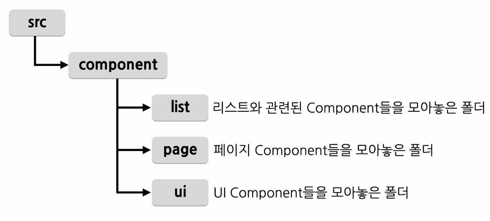
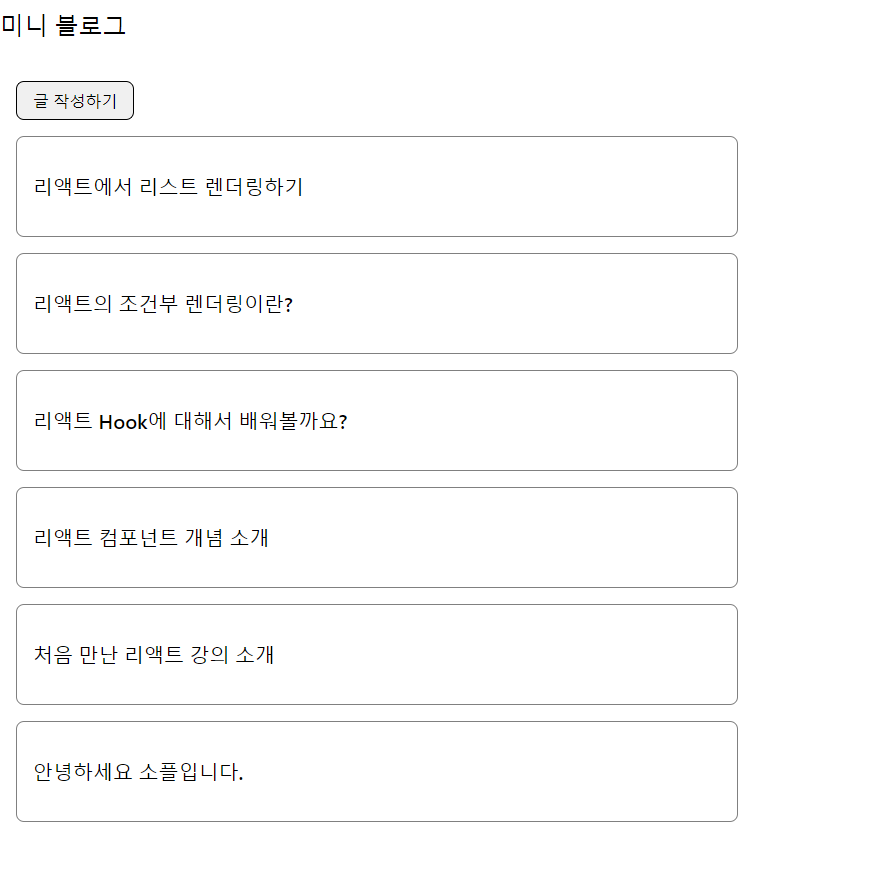
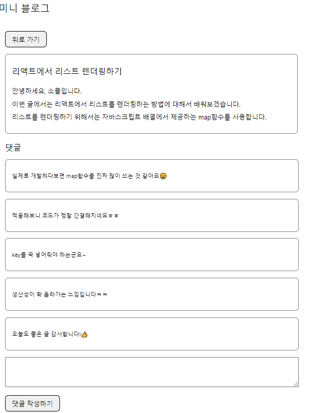

# Mini-blog

------

[toc]

----

## 프로젝트 생성 및 패키지 설치

```python
npx create-react-app mini-blog
cd mini-blog
npm start
npm install --save react-router-dom styled-components
```

------

## 미니 블로그에 필요한 기능

- 글 목록 보기 기능
- 글 보기 기능
- 댓글 보기 기능
- 글 작성 기능
- 댓글 작성 기능

---------

## 각 기능에 필요한 Component

- 글 목록 보기 기능
  - PostList, PostListItem
- 글 보기 기능 
  - Post
- 댓글 보기 기능
  - CommnetList, CommentListItem
- 글 작성 기능
  - PostWrite
- 댓글 작성 기능
  - CommentWrite

---------

## 폴더 구조



---------

## UI 컴포넌트 구성하기

- 사용자가 입력을 할 수 있게 해주는 Component
- Button 컴포넌트 
- TextInput 컴포넌트

## LIst 구성하기

- PostListItem
- PostList
- CommentListItem
- CommentList

## Page 구성하기

- MainPage
- PostWritePage
- PostViewPage

--------

## React-router-dom

- 라우팅을 쉽게 구현할 수 있도록 도와주는 라이브러리

```jsx
<BrowserRouter></BrowserRouter>
```

- 페이지 이동을 위해서 useNavigate() 훅을 사용
- https://reactrouter.com/

-------

## 라우팅 구형

- App.js 파일 수정
- Index.js파일에 App 출력

-------------



----------



--------

